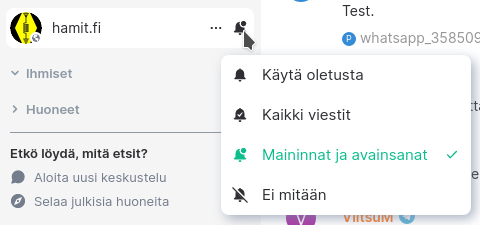
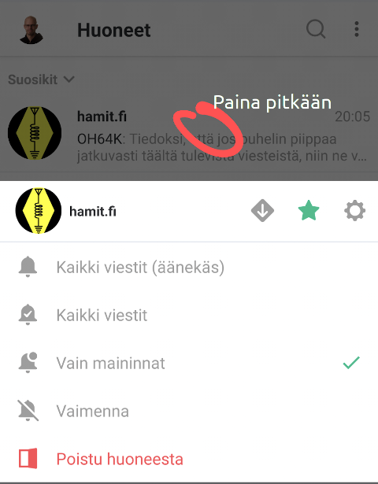

Tervetuloa keskustelemaan radioamatööriharrastuksesta! Tarkoituksemme on luoda miellyttävä keskusteluympäristö, jossa voimme keskustella harrastuksesta monipuolisesti. Tervetuloa, vanhat ja uudet!

Kanava ei ole sidottu mihinkään tiettyyn viestimeen, vaan sinne pääsee seuraavista viestimistä:

* [Matrix] - Suositeltu tapa liittyä
* [Telegram]
* [WhatsApp] – Katso huomautus!
* IRCNet: #hamit.fi

Huomautus WhatsApp-käyttäjille: Puhelinnumerosi näkyy WhatsAppin lisäksi IRC- ja Matrix-verkoissa käyttäjän lisätiedoissa (IRC: realname, Matrix: mxid). Tämä johtuu siitä, että WhatsAppissa käyttäjätunnus on sidottu käyttäjän puhelinnumeroon. **Mikäli haluat pitää puhelinnumerosi salaisena, älä käytä WhatsAppia.**

Muita viestimiä pystymme siltaamaan tarpeen mukaan. Siltaustekniikan tarjoaa Suomen hacklabien kattojärjestö [Hacklab ry].

Kanava ei ole sidottu mihinkään tiettyyn kerhoon tai paikkakuntaan, vaan on tarkoitettu kaikkeen suomenkieliseen keskusteluun radioamatööritoiminnasta. Monilla radioamatöörikerhoilla on myös omat kanavansa, joita voit löytää [linkkilistauksesta](linkkeja).

## Keskustelun säännöt

Ryhmäkeskustelu on tarkoitettu harrastukseen liittyvien asioiden käsittelyyn. Muistakin aiheista on lupa keskustella kohtuudella. Kunnioita muita ihmisiä ja keskustellessasi. Kiellettyä ovat erityisesti:

* Uhkaava käytös ja [vihapuhe]
* Poliittinen yllytys eli agitaatio
* Roskapostittaminen ja mainonta

## Vinkkejä

[Matrix]ia käyttäessäsi voit vaihtaa kanavalla näkyvän nimimerkkisi kutsumerkkiäsi vastaavaksi komennolla `/myroomnick OHXABC`

IRC:ssä oleva siltabotti `mx` välittää viestit muista
pikaviestinverkoista. Voit saada IRC-keskustelusta luettavamman, kun
käytät työkalua, joka poistaa `<mx>`-nimimerkin rivin alusta:

* Irssi: [Detelexify-skripti](https://github.com/zouppen/irssi-detelexify/)
* WeeChat: [Relaybot](https://github.com/weechat/weechat/wiki/Triggers#relaybot)

Telegrammissa oman radioamatöörikutsunsa voi asettaa username-kohtaan, jolloin se näkyy muiden verkkojen käyttäjille kivasti. Username on eri asia kuin oma nimesi. Se löytyy asetuksista kohdasta Settings → Edit Profile → Username.

### Ryhmän vaimentaminen

Nouseeko verenpaine suuresta määrästä viestejä? Ei hätää! Kanava kannattaa vaimentaa, jolloin saat huomautuksen vain niistä viesteistä, joissa mainitaan nimesi tai nimimerkkisi.

*Matrix työpöydällä*

*Matrix kännykässä*

Katso myös ohjeet englanniksi [Telegrammille](https://gadgetstouse.com/blog/2021/02/11/mute-chats-groups-channels-on-telegram/) ja [WhatsAppille](https://faq.whatsapp.com/iphone/chats/how-to-mute-or-unmute-group-notifications/?lang=en).

## Ilmoitukset

Kanavalle tulee automaattisesti seuraavat ilmoitukset:

* [SRAL:n](https://www.sral.fi/) nettisivujen uutiset ([datalähde](https://www.sral.fi/feed/))
* Tämän sivun blogi ([datalähde](https://hamit.fi/feed.xml))
* Uudet ja poistuneet [radioamatöörikutsut] Suomessa ([datalähde](https://github.com/OH6AD/koolitutka))
* Aktivoinnit [OHFF]-luontokohteissa ([datalähde](https://github.com/zouppen/wwff-db/))

(Tiedämme, että SRAL:n sivuilta tulevissa blogipostauksissa on ääkkösvirhe. Korjaamme h&amp;auml;iri&amp;ouml;n mahdollisimman pian. ;-)

## Moderointi

Ryhmäkeskustelua moderoidaan tarvittaessa. Moderaattoreina toimivat cos OH3GBQ, tsw OH3TW, Zouppen OH64K ja BFlorry. Yksittäisistä moderointipäätöksistä ei voi valittaa. Moderointilinjasta saa tietysti keskustella yleisellä tasolla, kun aihetta on.

[Matrix]: https://matrix.to/#/#hamit:hacklab.fi?via=hacklab.fi&via=matrix.org
[Telegram]: https://t.me/joinchat/WnDCZpW80L4yNjU8
[WhatsApp]: https://chat.whatsapp.com/Hkv4CW905HNGbJBdbVbfY7
[Hacklab ry]: https://hacklab.fi/
[vihapuhe]: https://fi.wikipedia.org/wiki/Vihapuhe
[OHFF]: https://ohff44.wordpress.com/
[radioamatöörikutsut]: https://www.traficom.fi/fi/kaytossa-olevat-radioamatoorien-kutsumerkit
